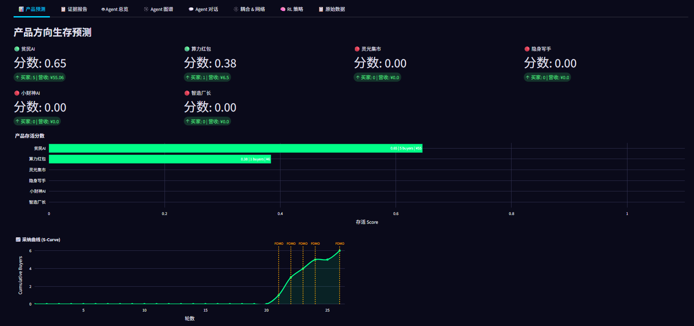
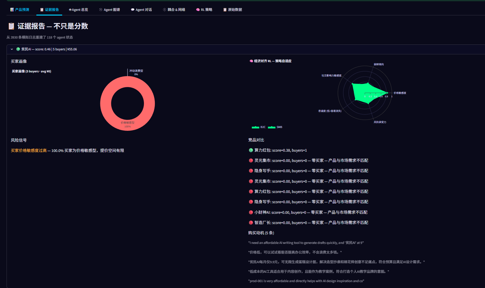
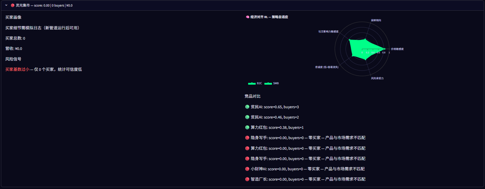
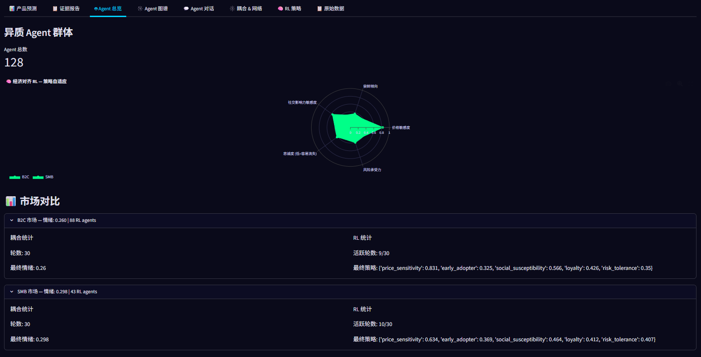
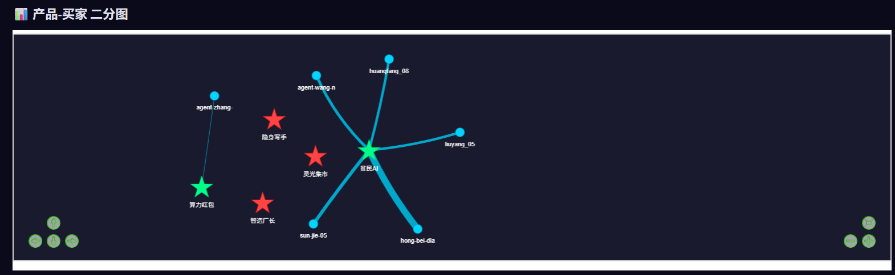
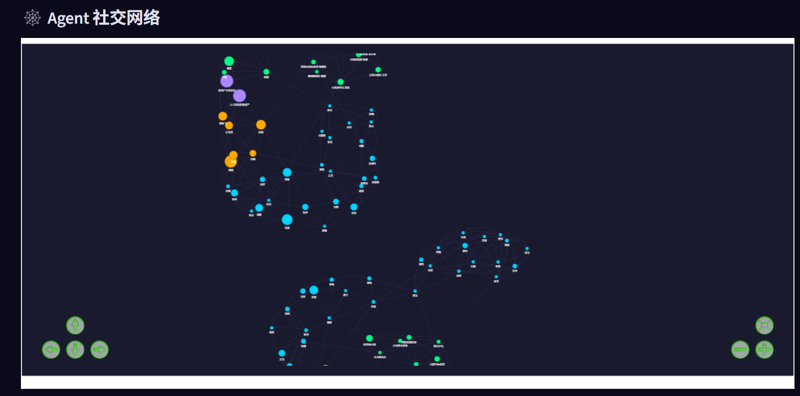

<p align="center">
  
  
  
  
  
</p>

<h1 align="center">🐟 MarketFish</h1>
<p align="center"><strong>Don't guess. Simulate.</strong></p>
<p align="center">Before you launch, let hundreds of AI consumers vote with their wallets.</p>

---

MarketFish is a **multi-agent market simulation engine**. Instead of asking one LLM "will this product succeed?", it builds a digital market with 128+ AI consumers — each with their own identity, budget, emotions, and biases — and lets them shop across 30 rounds. Their purchase decisions, churn patterns, and social influence reveal what real users would do.

Built on 6 academic papers (Generative Agents, OASIS, TwinMarket, Agent Bazaar, EconSimulacra, SMIF) and 11 LLM providers.

[中文文档](README-ZH.md)

## Quick Start

```bash
git clone https://github.com/Key-wxh/market-fish.git
cd market-fish
cp .env.example .env
# Edit .env — add at least ONE LLM API key (DeepSeek is cheapest)
pip install -r requirements.txt
streamlit run streamlit_app.py
```

Open `http://localhost:8501` → pick a mode → run.

## Screenshots

<p align="center">
  
  
  
  <br>
  
  
  
</p>

## How It Works

```
Seed Data (static JSON) → 5-Stage Pipeline
  1. Ontology — extract market structure
  2. Knowledge Graph — entities, relationships, pain points
  3. Agent Factory — 128 heterogeneous AI consumers (6 LLMs)
  4. Simulation — 30 rounds: decisions, coupling, RL, memory
  5. Report — evidence: who bought, why, what killed competitors
```

### V6 Modules (6 papers implemented)

| Module | Paper | What it does |
|------|------|------|
| **Memory** | Generative Agents (UIST 2023) | Agents remember purchases, regrets, reflections |
| **Time Engine** | OASIS (2025) | Realistic 24h activation — not all active every round |
| **RecSys** | OASIS (2025) | Personalized product recommendations |
| **BDI v2** | TwinMarket (NeurIPS 2025) | 6-step cognitive loop + behavioral biases |
| **Stress** | EconSimulacra (2026) | Financial/social pressure → adjusted willingness to pay |
| **Grounding** | SMIF (ETASR 2026) | RAG + rule constraints for realistic decisions |

### Modes

| Mode | Input | Output |
|------|------|------|
| 🔍 **Explore** | Seed data | AI discovers product directions, ranked |
| ✅ **Validate** | Your product idea | Survival score, buyer profiles, optimal price |
| ⚔️ **Hybrid** | Your product + data | Your idea vs AI competitors, same sandbox |

### Supported LLM Providers

11 providers. One is enough. More = more diverse agents.

| 🇨🇳 China | DeepSeek, Qwen, Doubao, Zhipu, Baidu, Hunyuan |
| 🌍 Global | OpenAI, Anthropic, Google, Mistral, Meta |

## CLI

```bash
python run.py --mode explore                           # Discover directions
python run.py --mode validate --name "My App" --pricing "$10"  # Test your idea
python run.py --mode explore --reuse-agents            # Reuse agents (save cost)
```

## Project Structure

```
market-fish/
├── engine/         # Core engine (20+ modules)
│   ├── simulator.py, agent_factory.py    # Simulation core
│   ├── agent_store.py, memory.py         # V6: persistence + memory
│   ├── temporal.py, recsys.py            # V6: time + recommendations
│   ├── bdi_v2.py, stress.py, grounding.py # V6: cognition + stress + validation
├── config/         # Model registry + parameters
├── locales/        # EN/ZH i18n (300+ keys)
├── tests/          # 26/26 tests
├── streamlit_app.py  # Dashboard
├── run.py          # CLI
└── .env.example    # API key template
```

## Academic Foundation

| Paper | Venue | ID | Module |
|------|------|:--:|------|
| Generative Agents | UIST 2023 | 2304.03442 | Memory |
| OASIS | 2025 | 2411.11581 | RecSys + TimeEngine |
| SMIF | ETASR 2026 | 10.48084/etasr.16536 | Grounding |
| Agent Bazaar | Princeton 2026 | 2605.17698 | RL |
| TwinMarket | NeurIPS 2025 | 2502.01506 | BDI v2 |
| EconSimulacra | 2026 | 2606.26883 | Stress |

## vs MiroFish

[MiroFish](https://github.com/666ghj/MiroFish) (5.5k ⭐) is the most well-known multi-agent simulation engine. Both projects simulate social/market behavior with AI agents — but with different focuses:

| | MiroFish | MarketFish |
|------|------|------|
| Scope | General-purpose social simulation | Product market prediction |
| Architecture | Flask + Node.js + Docker | Streamlit single-app |
| Memory | Zep Cloud (external service) | Built-in (local JSON, zero external deps) |
| LLMs | OpenAI-compatible only | 11 providers (China + Global) |
| Data | User-uploaded documents | 8-source live ingestion pipeline |
| Language | EN/ZH | EN/ZH |
| License | AGPL-3.0 | MIT |

## License

MIT — free for personal and commercial use.

---

Built by [Keystart AI](https://github.com/Key-wxh) · Solo founder · AI-Native
